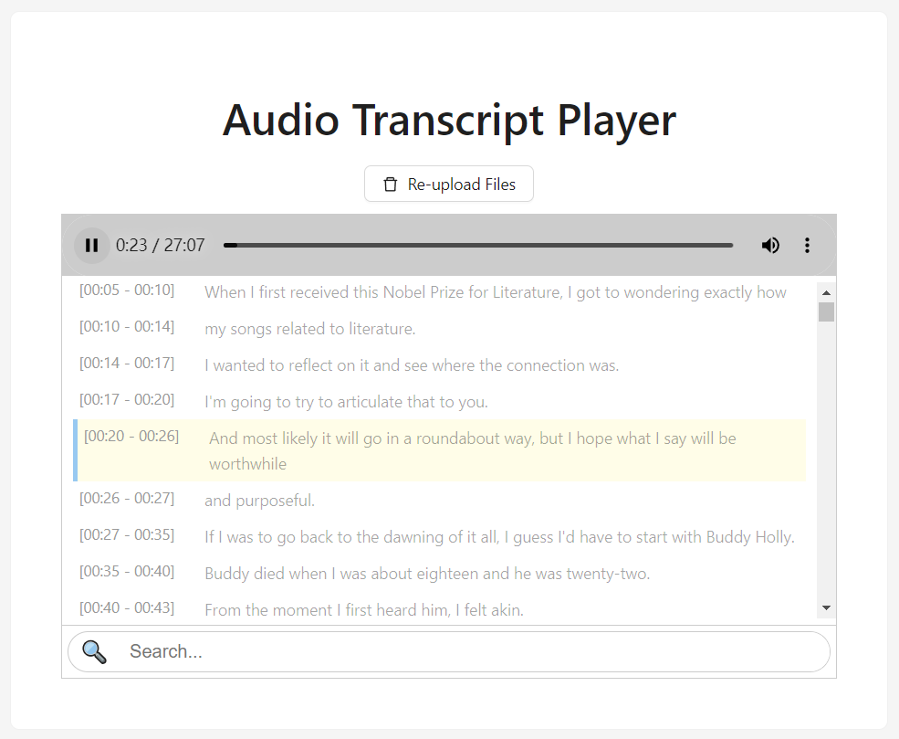

# Audio Transcript Player

[中文](README.md)

Demo: https://emuqi.github.io/Audio-Transcript-Player/

Audio Transcript Player is a web-based audio playback tool built on [webvtt-player](https://github.com/umd-mith/webvtt-player). It allows you to upload audio and subtitle files (SRT, VTT) locally, enabling synchronized audio playback with subtitles. You can click on the subtitles to jump to the corresponding audio position. Ideal for listening to and learning from English podcasts.



## Local Development

**Prerequisites**

- Node.js >= 18
- npm

**Steps**

```bash
# Clone the repository
git clone https://github.com/emuqi/Audio-Transcript-Player.git
cd Audio-Transcript-Player

# Install dependencies
npm install

# Start the development server
npm run dev
```

The dev server runs at `http://localhost:5173` by default.

## Deployment

**Build for production**

```bash
npm run build
```

The build output is in the `dist/` folder. Deploy it to any static hosting service.

**Deploy to GitHub Pages**

1. Build the project: `npm run build`
2. Push the contents of the `dist/` folder to the `gh-pages` branch, or configure the Pages source to the `dist/` directory in repository settings.

You can also use the [gh-pages](https://github.com/tschaub/gh-pages) package for one-command deployment:

```bash
npm install -D gh-pages
npx gh-pages -d dist
```

**Other platforms**

| Platform | How to deploy |
|----------|---------------|
| Vercel | Import the repo, build command `npm run build`, output directory `dist` |
| Netlify | Import the repo, build command `npm run build`, publish directory `dist` |
| Cloudflare Pages | Import the repo, build command `npm run build`, output directory `dist` |
| Self-hosted server | Serve the `dist/` folder with Nginx, Apache, or any web server |
