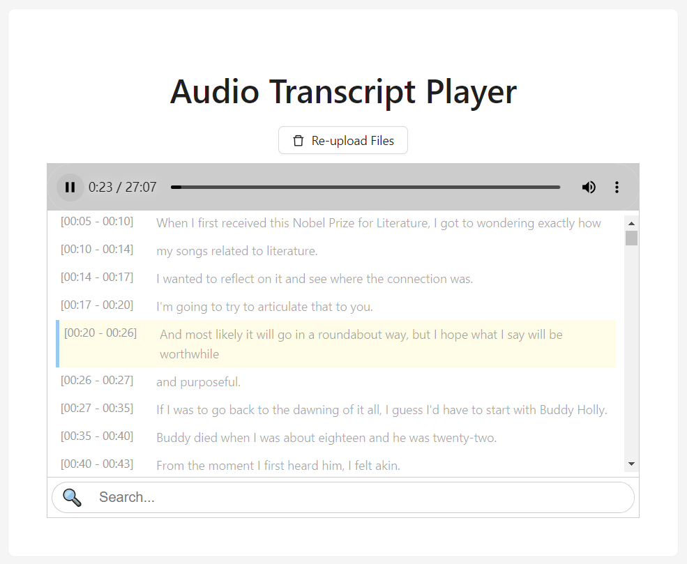

# Audio Transcript Player

Demo：https://emuqi.github.io/Audio-Transcript-Player/

Audio Transcript Player is a web-based audio playback tool built on [webvtt-player](https://github.com/umd-mith/webvtt-player). It allows you to upload audio and subtitle files (SRT, VTT) locally, enabling synchronized audio playback with subtitles. You can click on the subtitles to jump to the corresponding audio position. Ideal for listening to and learning from English podcasts.

Audio Transcript Player 是一个基于 webvtt-player 的网页音频播放工具。支持本地上传音频和字幕文件（SRT、VTT），实现音频播放与字幕同步，并可通过点击字幕跳转到对应位置。适用于英语播客听力和学习。

